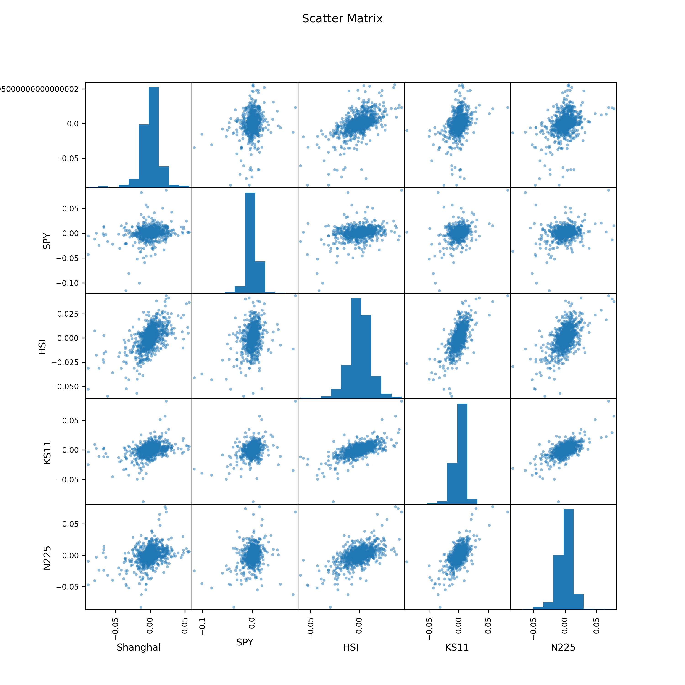
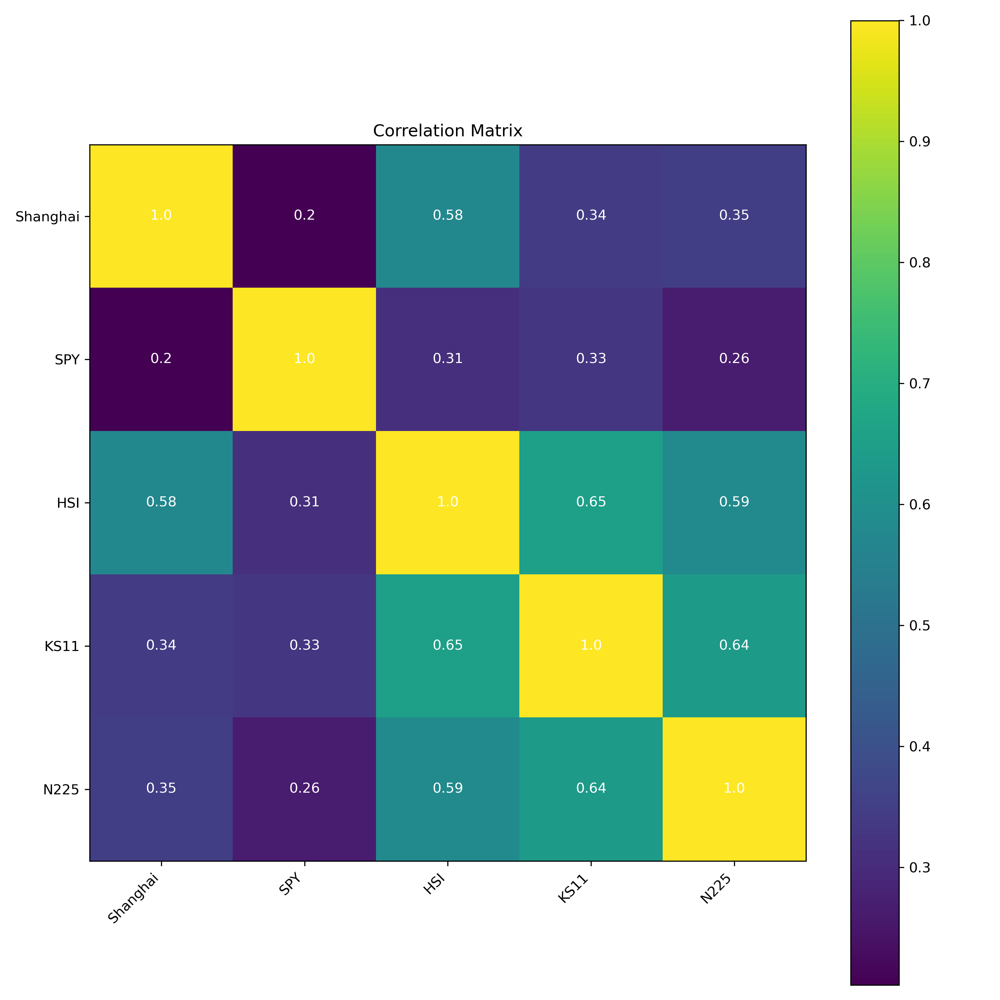
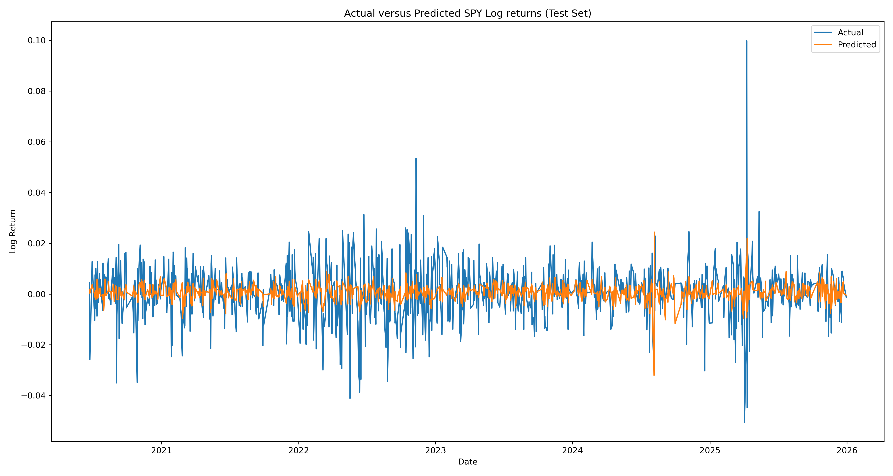

# SPY Return Prediction using Asian Equity Indices
Predicting SPY daily log returns using multiple Asian indices in Python

## Overview
This project investigates whether the daily log returns of major Asian equity indices can explain the same-day return of the SPY ETF.
Three Ordinary Least Squares (OLS) regression models were developed and compared using out-of-sample testing.

## Data
Daily adjusted closing prices were downloaded using the `yfinance` package for:

- SPY
- Nikkei 225 (^N225)
- Hang Seng (^HSI)
- Shanghai Composite (000001.SS)
- KOSPI (^KS11)

Period:
2015-01-01 to 2026-01-01

## Methodology
- Download historical prices using yfinance
- Compute daily log returns
- Split data into training and testing sets
- Fit multiple OLS regression models using Statsmodels
- Compare models using:
  - RMSE
  - Training R²
  - Test R²
  - Adjusted R²

## Models
1. SPY ~ Nikkei 225
2. SPY ~ Nikkei 225 + Hang Seng
3. SPY ~ Nikkei 225 + Hang Seng + Shanghai Composite + KOSPI

## Results
The Japan-only model achieved the lowest out-of-sample RMSE.
Adding additional Asian indices increased in-sample R² but did not improve predictive performance on unseen data, suggesting limited incremental explanatory power.

| Model | Predictors | Test RMSE | Test R-Squared | Train R-Squared | Adjusted R-Squared |
|-------|------------|----------:|---------------:|----------------:|-------------------:|
| Japan | N225 | 0.010889 | -0.034614 | 0.069645 | 0.068713 |
| Japan + Hong Kong | N225 + HSI | 0.011040 | -0.063439 | 0.106628 | 0.104836 |
| Full Model | N225 + HSI + KS11 + Shanghai | 0.011043 | -0.064121 | 0.127309 | 0.123801 |

## Visualisations
The project includes:

- Scatter matrix
- Correlation heatmap
- Actual vs Predicted SPY returns

### Scatter Matrix

### Correlation Heatmap

### Actual vs Predicted SPY Returns

## Libraries
- pandas
- numpy
- yfinance
- statsmodels
- matplotlib

## Author
Jules Bourlot
